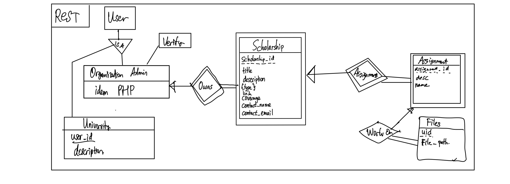

# Rest Service

## About
Rest Service for the Scholee Website.

Created using Express

## Prerequisite
1. Node JS minimal version 18
2. Yarn
3. PostgreSQL

## How to Run
1. Install dependencies using Yarn
```
yarn install
```

2. Migrate database if you haven't done it yet. Make sure to create database first in the PostgreSQL with the name `scholeeadmin`
```
yarn migrate
```

3. Start the app by using
```
yarn start
```

## Database Scheme
The database scheme used here is as follows


## API Documentation
Using Swagger, on /doc, we give the documentation here.

## Contributors
| Functionalities | 13521004   | 13521007 | 13521024 | 
| --------------- | :--------: | :------: | :------: |
| Setup           |            |          | &check;  |
| Assignment      | &check;    | &check;  |          |
| Files           | &check;    | &check;  |    |          
| JWT Authentication | &check; |          |          |
| Database        |    |   |&check;   |
| Organization    |  &check;    |          | &check; |
| Scholarship     |  &check;    |&check;   | &check; |
| University       | &check;    |          |         |
|  Scholarship Polling   |            | &check;  | &check;  |
| University Polling |    |  | &check; |
| Redis  | | | &check; |
